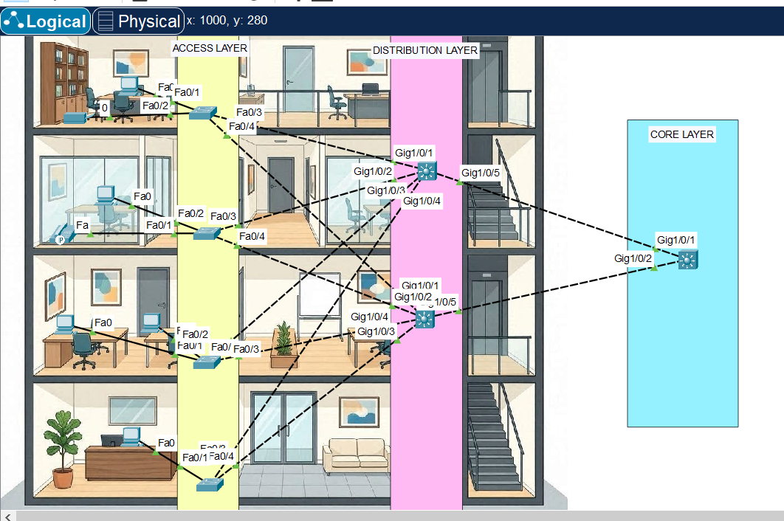
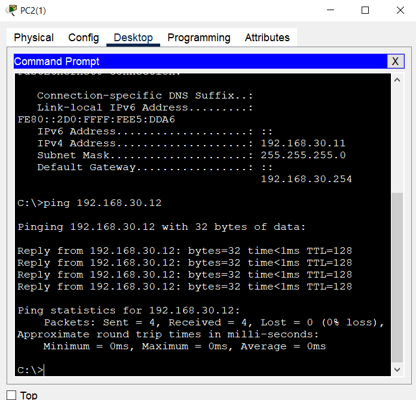
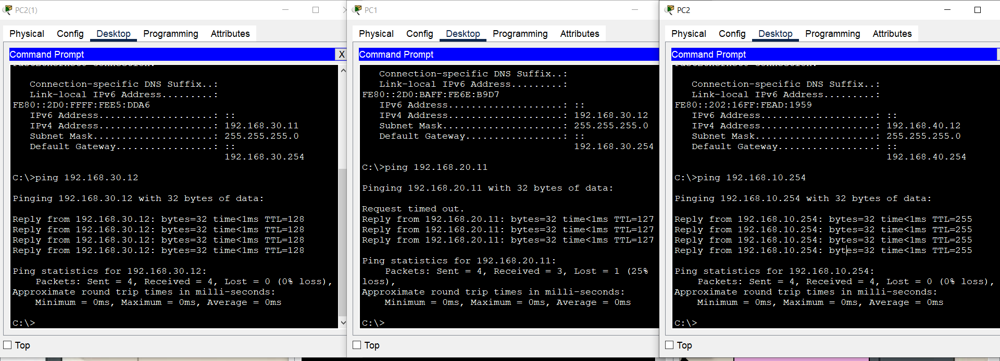
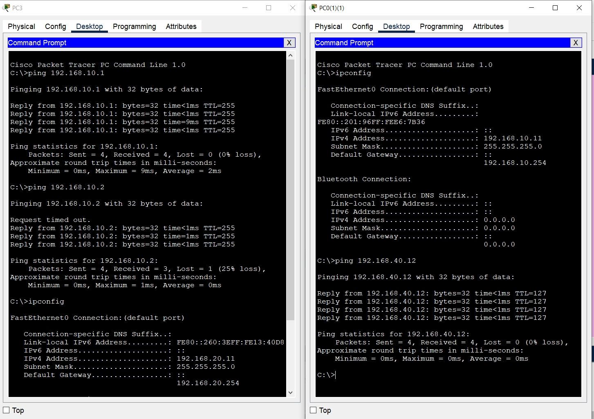
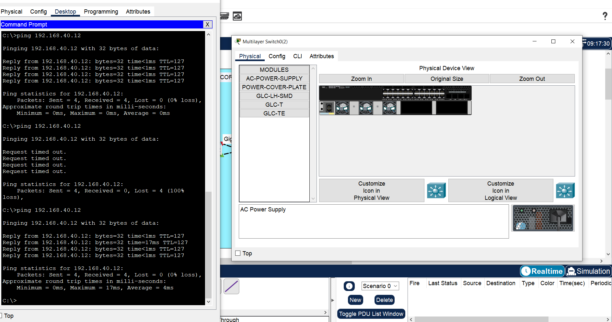

# Three-Layer Network Architecture (Cisco Packet Tracer)

## 📌 Overview
This project implements a **hierarchical three-layer network architecture** (Access, Distribution, Core) in Cisco Packet Tracer, simulating a 4-floor office building where each floor represents a different department. The design includes VLAN segmentation, inter-VLAN routing, first-hop redundancy (HSRP), and dynamic routing (OSPF) between the Distribution and Core layers.

## 🖧 Network Topology

The network consists of:
- **4x Access Layer Switches** — one per floor/department, providing Layer 2 connectivity to end devices
- **2x Distribution Layer Switches** (Layer 3, redundant pair) — inter-VLAN routing and first-hop redundancy
- **1x Core Layer Switch** (Layer 3) — high-speed backbone connecting both Distribution switches

## 🌐 VLAN & IP Addressing Scheme

| VLAN ID | Name | Floor/Department | Network | Gateway (HSRP VIP) |
|---|---|---|---|---|
| 10 | Sales | Floor 1 | 192.168.10.0/24 | 192.168.10.254 |
| 20 | IT | Floor 2 | 192.168.20.0/24 | 192.168.20.254 |
| 30 | HR | Floor 3 | 192.168.30.0/24 | 192.168.30.254 |
| 40 | Finance | Floor 4 | 192.168.40.0/24 | 192.168.40.254 |
| 99 | Management | All switches | 192.168.99.0/24 | 192.168.99.254 |

**Distribution-to-Distribution SVI IPs:** `.1` on Distribution Switch 1 (HSRP Active, priority 110), `.2` on Distribution Switch 2 (HSRP Standby)

**Distribution-to-Core links (routed, /30 subnets):**

| Link | Subnet | Distribution IP | Core IP |
|---|---|---|---|
| Distro1 ↔ Core | 10.0.0.0/30 | 10.0.0.1 | 10.0.0.2 |
| Distro2 ↔ Core | 10.0.0.4/30 | 10.0.0.5 | 10.0.0.6 |

## ⚙️ Configuration Summary

### Access Layer (x4 switches)
- One VLAN created per switch, matching the floor's department
- End-device ports set to `switchport mode access` with the department VLAN
- Two uplink ports set to `switchport mode trunk` — one to each Distribution switch (for redundancy)

### Distribution Layer (x2 switches)
- All VLANs (10, 20, 30, 40, 99) created on both switches
- Trunk ports toward all 4 Access switches
- `ip routing` enabled
- SVI (Switched Virtual Interface) created per VLAN with a unique IP per switch
- **HSRP** configured per VLAN: Distribution 1 = Active (priority 110, preempt), Distribution 2 = Standby, shared virtual IP `x.x.x.254`
- Routed (`no switchport`) point-to-point link to the Core switch
- **DHCP server** pools configured per VLAN, with `default-router` set to the HSRP virtual IP
- **OSPF area 0** advertising all VLAN subnets and the Core-facing /30 link

### Core Layer
- Two routed ports (`no switchport`), one to each Distribution switch
- **OSPF area 0** advertising both /30 links to Distribution
- No VLANs — pure Layer 3 backbone

## ✅ Testing & Verification

### Same-VLAN connectivity
PC-to-PC ping within the same VLAN (HR, VLAN 30) — successful, confirming Access Layer switching works.

### Inter-VLAN routing
Pings across different VLANs (Sales → Finance, HR → IT) succeeded, confirming the Distribution layer correctly routes between VLANs via OSPF.

### HSRP virtual gateway & both Distribution SVIs reachable
Pinging the HSRP virtual IP (`192.168.10.254`) and both underlying SVIs (`192.168.10.1` and `.2`) succeeded, confirming HSRP is correctly configured.

### Redundancy / failover test
With a continuous ping running to a remote VLAN, Distribution Switch 1 (the active HSRP router) was powered off mid-test:

- Ping succeeded before the failure
- All 4 packets were lost during the ~10-second HSRP failover window
- Ping succeeded again afterward, now routed through Distribution Switch 2 — confirming the redundant design keeps the network operational when a Distribution switch fails

## 🛠️ Troubleshooting Notes
Real issues encountered and resolved during the build:

1. **`router ospf 1` silently exited to global config** — caused by forgetting to enable `ip routing` first on the Core switch. Enabling `ip routing` before entering `router ospf` fixed it.
2. **VLANs showed as "not active" on trunk ports** — VLAN databases are local per switch; VLANs had to be created on the Distribution switches themselves, not just the Access switches, even though Distribution doesn't host any end devices.
3. **PCs got APIPA addresses / DHCP failed** — traced to two causes: (a) STP forwarding delay on ports behind a switch, resolved by advancing simulation time, and (b) PCs having a wireless NIC installed by default instead of the wired `PT-HOST-NM-1CFE` module.
4. **`VLAN 1` could not be deleted** — expected behavior; VLAN 1 is the default VLAN on Cisco switches and cannot be removed.

## 📂 Files
- `3-LAYER-ARCH.pkt` — Packet Tracer project file
- `topology.png` — Network topology diagram
- `screenshot/` — Connectivity test screenshots

## 🎯 Skills Demonstrated
- Three-layer hierarchical network design (Access / Distribution / Core)
- VLAN segmentation and inter-VLAN routing
- 802.1Q trunking
- First-hop redundancy protocol (HSRP)
- Dynamic routing with OSPF
- DHCP server configuration per VLAN
- Network troubleshooting and failover testing
